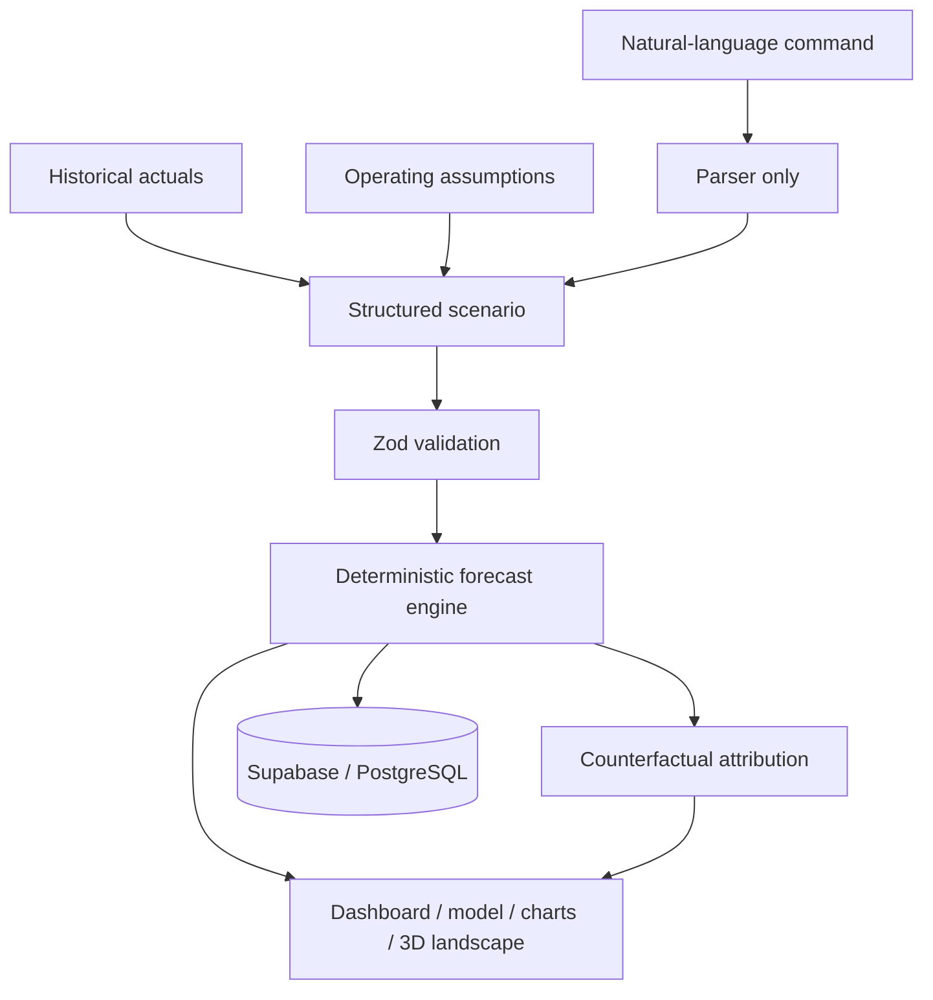

# Runway Lab

**Interactive financial modeling and scenario planning.**

Runway Lab turns historical financial data into transparent, interactive operating scenarios. Users can change revenue growth, staffing, infrastructure, marketing, and financing assumptions, then see how those decisions affect cash flow, expenses, break-even, and runway.

I built this as a personal learning project to apply concepts from my AFM 191 accounting coursework through software development. It also gave me a practical way to explore how fintech products represent financial models, experiment with React application architecture, and build interactive 3D visualizations with Three.js.

The central rule is simple: **AI may structure an input or explain an output, but it never calculates a financial result.** Every number shown in the product comes from the same deterministic TypeScript engine.

## What is included

- Polished dark-mode financial workspace
- Acme AI sample business with 12 months of historical actuals
- Integrated three-statement model with 12 Actual and 12 Forecast columns
- Live scenario builder for growth, operating costs, staffing, and financing events
- Side-by-side comparison and calculated runway attribution
- Recharts analysis and an interactive React Three Fiber **Runway Landscape**
- CSV import, validated command parser, and Supabase schema with RLS
- Pure financial-engine unit tests

## Architecture



The calculation layer in [`lib/forecasting`](./lib/forecasting) is framework-independent. React components, APIs, persistence, and visualizations consume its typed outputs; they never reimplement formulas.

### Forecast formulas

```text
Revenue(t)      = Revenue(t-1) × (1 + monthly growth)
Payroll(t)      = Base payroll + monthly cost of active planned hires
Cloud(t)        = Revenue(t) × cloud percentage
Expenses(t)     = Payroll + Cloud + Marketing + Software + Other OpEx
Net cash flow   = Revenue - Expenses
Ending cash(t)  = Ending cash(t-1) + Net cash flow + Funding events
```

Runway is simulated until cash reaches zero, with fractional-month interpolation. Attribution uses counterfactual reruns: restore one base-case assumption group, rerun the forecast, and measure its marginal runway impact.

## Product surfaces

| Route | Purpose |
| --- | --- |
| `/` | Focused product landing page |
| `/dashboard` | Metrics, analysis, assumptions, and Runway Landscape |
| `/model` | Auditable Actual + Forecast table and CSV import |
| `/scenarios` | Live operating assumption and event editor |
| `/compare` | Comparison, attribution, and 2D/3D trajectories |
| `/api/forecast` | Validated deterministic forecast endpoint |
| `/api/agent` | Validated financial-agent planning endpoint |
| `/api/parse-scenario` | Deterministic command-parser fallback |
| `/api/scenarios` | Authenticated Supabase scenario read/write endpoint |

## Tech stack

Next.js App Router, TypeScript, Tailwind CSS, Recharts, React Three Fiber, Three.js, Drei, Zod, Supabase/PostgreSQL, Vitest, and Vercel.

## Local setup

Requires Node.js 20+ and npm.

```bash
npm install
cp .env.example .env.local
npm run dev
```

Open [http://localhost:3000](http://localhost:3000). Supabase is optional; all screens work immediately with included sample data and browser-local persistence.

To enable private cloud autosave:

1. Create a Supabase project and apply the SQL files in [`supabase/migrations`](./supabase/migrations) in numeric order.
2. Copy the project URL and publishable key into `.env.local` using [`.env.example`](./.env.example).
3. In Supabase Auth URL Configuration, set the local Site URL to `http://localhost:3000` and allow `http://localhost:3000/auth/callback` as a redirect URL. Add the deployed equivalents when hosting the app.
4. Restart the development server and use **Local only** in the header to request an email sign-in link.

Signed-out use remains local. On a user's first sign-in, the current browser model becomes their initial cloud model. Later approved statement, scenario, spreadsheet, and agent changes autosave to the private model row protected by RLS. The original uploaded Excel file is never stored.

## Validation and testing

```bash
npm test
npm run build
```

Tests cover determinism, hire activation, funding timing, runway detection, model-state validation, spreadsheet reconciliation, and scenario changes.

## CSV format

```csv
month,revenue,payroll,cloud,marketing,software,other,cash
2026-01,42000,65000,8000,12000,4000,6000,720000
2026-02,46000,65000,8500,12000,4100,5200,671700
```

## Financial agent

The agent can draft scenario creation, selection, renaming, assumption changes, historical-statement adjustments, and reconciliation actions. Every plan is validated and shown for approval before it changes model data. The deterministic forecast engine remains responsible for all calculated outputs.

The included local parser works without an API key. To enable Gemini interpretation, add `GEMINI_API_KEY` to `.env.local`; `GEMINI_MODEL` can override the default model.

## Roadmap

- Versioned snapshots and assumption audit history
- Flexible CSV column mapping
- Dependency graph for assumption lineage
- Optional provider-backed language parser and grounded explanations
- Shareable read-only scenario links

## Design intent

Runway Lab is a personal exploration of accounting, financial modeling, fintech, and interactive software. The interface favors calm density, visible assumptions, restrained motion, and decision-useful visualization over decorative dashboard patterns.
